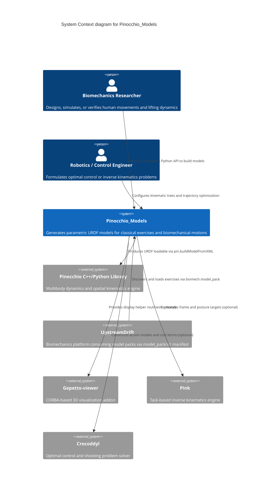

# Architecture Map: Pinocchio_Models

Visual and structured map of the system architecture for `Pinocchio_Models`,
aligned with the C4 model standard and the maintainable architecture contract.

## 1. System Context (C4Context)

High-level diagram showing users, primary systems, and external ecosystem dependencies.



---

## 2. Container Diagram (C4Container)

Container-level view showing internal package organization, core builders, and addon adapters.

```mermaid
C4Container
    title Container diagram for Pinocchio_Models

    Person(user, "User / Downstream Caller", "Biomechanics tools or Python scripts")

    Container_Boundary(c1, "Pinocchio_Models Package")
        Container(cli, "CLI Entrypoint", "python -m pinocchio_models", "Parses CLI arguments, formats URDF or JSON output")
        Container(model_pack, "Model Pack Integration", "pinocchio_models.model_pack", "Provides discovery and manifest access for UpstreamDrift")
        Container(exercise_builders, "Exercise Builders", "pinocchio_models.exercises.*", "Exercise-specific builders (squat, deadlift, bench_press, snatch, clean_and_jerk, gait, sit_to_stand)")
        Container(shared_core, "Shared Biomechanics Core", "pinocchio_models.shared.*", "Anthropometric body models, barbell models, inertia geometry, URDF helpers")
        Container(contracts, "Contracts & Validation", "pinocchio_models.shared.contracts & robotics_contracts", "Design-by-Contract preconditions and postconditions")
        Container(addons, "Optional Addons", "pinocchio_models.addons.*", "Optional adapters for Gepetto, Pink, and Crocoddyl")
    Container_Boundary_End()

    System_Ext(pinocchio_core, "Pinocchio Engine", "External dynamics solver")
    System_Ext(addons_ext, "External Addon Libraries", "gepetto-viewer-corba, pin-pink, crocoddyl")

    Rel(user, cli, "Invokes via CLI flags")
    Rel(user, exercise_builders, "Calls build_*_model() API")
    Rel(user, model_pack, "Calls manifest(), resolve(), list_exercises()")

    Rel(cli, exercise_builders, "Invokes selected builder")
    Rel(exercise_builders, shared_core, "Assembles body segments and barbell links")
    Rel(exercise_builders, contracts, "Enforces geometry and URDF tree validity")
    Rel(shared_core, contracts, "Validates segment dimensions and mass distributions")

    Rel(user, addons, "Invokes visualization or control routines")
    Rel(addons, addons_ext, "Interacts with optional third-party engines")
    Rel(exercise_builders, pinocchio_core, "Outputs URDF XML consumed by Pinocchio")
```

---

## Feature Map

| Capability                           | Component              | Interface                                                               | Evidence                                          |
| ------------------------------------ | ---------------------- | ----------------------------------------------------------------------- | ------------------------------------------------- |
| URDF Model Generation                | Exercise Builders      | `pinocchio_models.exercises.<exercise>.build_<exercise>_model`          | `tests/unit/test_exercises.py`                    |
| Shared Full-Body Anthropometrics     | Shared Core            | `pinocchio_models.shared.body.body_model.create_full_body`              | `tests/unit/test_body_model.py`                   |
| Olympic Barbell Construction         | Shared Core            | `pinocchio_models.shared.barbell.barbell_model.create_barbell_links`    | `tests/unit/test_barbell_model.py`                |
| UpstreamDrift Model Pack Manifest    | Model Pack             | `pinocchio_models.model_pack.resolve`, `manifest`                       | `tests/unit/test_model_pack.py`                   |
| CLI Generation & JSON Output         | CLI Entrypoint         | `pinocchio_models.__main__.main`                                        | `tests/unit/test_cli.py`                          |
| Gepetto Visualization Adapter        | Optional Addons        | `pinocchio_models.addons.gepetto.viewer.create_viewer`                  | `tests/unit/addons/test_gepetto.py`               |
| Pink Inverse Kinematics Adapter      | Optional Addons        | `pinocchio_models.addons.pink.ik_solver.create_ik_problem`              | `tests/unit/addons/test_pink.py`                  |
| Crocoddyl Optimal Control Adapter    | Optional Addons        | `pinocchio_models.addons.crocoddyl.optimal_control.create_exercise_ocp` | `tests/unit/addons/test_crocoddyl.py`             |
| Design-by-Contract Validation        | Contracts              | `pinocchio_models.shared.contracts.preconditions`, `postconditions`     | `tests/unit/test_contracts.py`                    |
| Architecture Map Contract Validation | Architecture Validator | `scripts/architecture_map_contract.py`                                  | `tests/scripts/test_architecture_map_contract.py` |

---

## Architecture Change Log

| Date       | Issue / PR | Description                                                                                            |
| ---------- | ---------- | ------------------------------------------------------------------------------------------------------ |
| 2026-09-10 | #1607      | Initial C4 architecture map specification (Context, Container, Feature Map, Change Log) per Epic #1594 |
