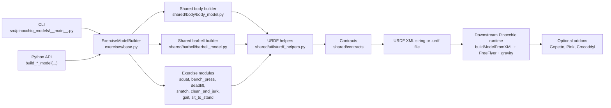
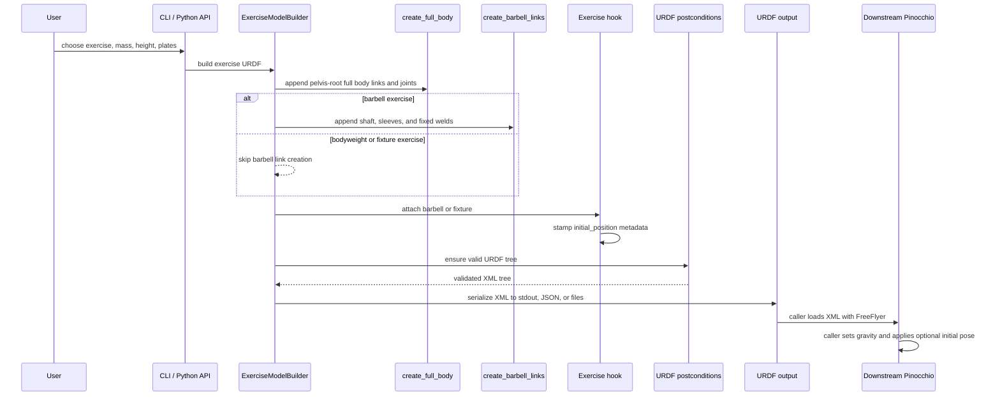

# Model Generation Architecture

Issue: [#194](https://github.com/D-sorganization/Pinocchio_Models/issues/194).

This page diagrams the code path that turns CLI or Python API inputs into
Pinocchio-ready URDF XML. It is intentionally scoped to the core package
boundary: generated URDF is this repository's output, while Pinocchio model
loading, floating-base insertion, and gravity setup happen in downstream code.

## Component Diagram

### Boundaries

| Boundary          | Owned here                                                                   | Owned by downstream caller                                 |
| ----------------- | ---------------------------------------------------------------------------- | ---------------------------------------------------------- |
| Model description | URDF links, joints, inertias, visuals, collisions, and initial-pose metadata | Pinocchio model/data objects                               |
| Floating base     | Documented expectation only                                                  | `pin.JointModelFreeFlyer()` during load                    |
| Gravity           | Not encoded in URDF                                                          | `model.gravity` assignment                                 |
| Optional tooling  | Import-safe addon wrappers                                                   | Installed Gepetto, Pink, Crocoddyl, and Pinocchio packages |

## Generation Sequence

## Key Design Rules

- URDF is the interchange format for all generated models.
- Z is vertical, X is forward, and Y completes the right-hand frame.
- The pelvis is the URDF root link; Pinocchio adds the floating base at load
  time.
- Compound anatomical joints are represented as chains of single-axis URDF
  revolute joints connected by virtual links.
- Exercise modules use `create_full_body()` and `create_barbell_links()`
  instead of duplicating segment or barbell internals.
- `initial_position` attributes are metadata. Pinocchio ignores them unless a
  caller explicitly applies them with `get_initial_configuration(...)`.

## Extension Checklist

When adding or changing an exercise builder:

1. Add shared dimensions or limits to `shared/constants.py` or the relevant
   spec dataclass instead of duplicating values in the exercise module.
2. Reuse `ExerciseModelBuilder.build()` unless the whole assembly flow changes.
3. Keep barbell attachment logic in the exercise hook and leave body/barbell
   construction in the shared builders.
4. Validate generated XML through the existing postcondition helpers.
5. Update this page if the data flow, runtime boundary, or optional-addon
   boundary changes.
