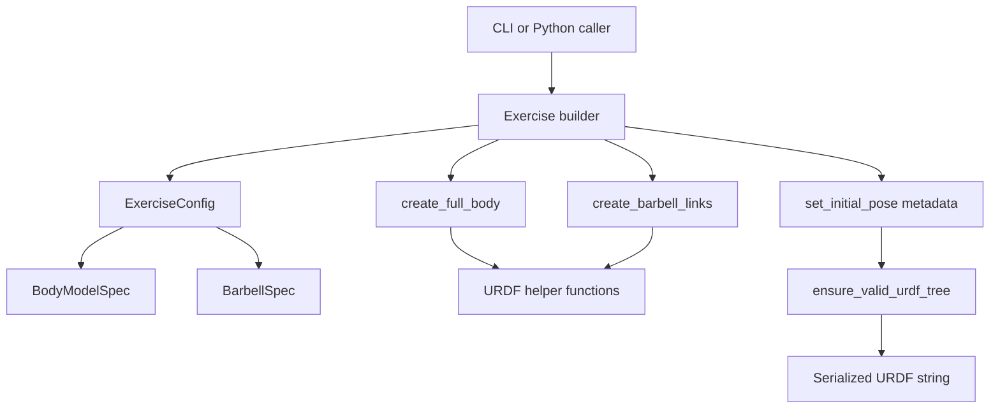

# Developer Guide

This guide explains how the repository is organized and how to make focused
changes without breaking the URDF generation contract.

## Repository Map

| Path | Responsibility |
| --- | --- |
| `src/pinocchio_models/__main__.py` | CLI parsing, argument validation, and URDF output. |
| `src/pinocchio_models/exercises/` | Exercise-specific builders and starting poses. |
| `src/pinocchio_models/shared/body/` | Anthropometric specs, segment table, and full-body assembly. |
| `src/pinocchio_models/shared/barbell/` | Olympic barbell specs, sleeve/shaft geometry, and fixed joints. |
| `src/pinocchio_models/shared/utils/geometry.py` | Shared inertia formulas. |
| `src/pinocchio_models/shared/utils/urdf_helpers.py` | XML helpers for links, joints, geometry, serialization, and initial-pose metadata. |
| `src/pinocchio_models/shared/contracts/` | Design-by-contract guards for inputs and generated outputs. |
| `src/pinocchio_models/addons/` | Optional integrations for Gepetto, Pink, and Crocoddyl. |
| `src/pinocchio_models/optimization/` | Exercise objective data and phase interpolation helpers. |
| `tests/` | Unit, integration, parity, and benchmark coverage. |
| `docs/` | Architecture notes, API usage, and design records. |

## Model Generation Flow

The core package generates deterministic URDF XML. It does not import Pinocchio
for basic model generation, which keeps the package usable without heavy
simulation dependencies.



Runtime dynamics setup is a caller concern. Downstream code should load the
URDF with `pin.buildModelFromXML`, add `pin.JointModelFreeFlyer()` when a
floating base is needed, set `model.gravity`, and apply initial-pose metadata
with `get_initial_configuration` if the exercise start pose matters.

## Architectural Contracts

Keep these invariants intact when changing builders or helpers:

- URDF is the interchange format for every generated model.
- Coordinates are Z-up and X-forward.
- Gravity is never encoded in URDF.
- The pelvis is the root link; Pinocchio adds the free flyer programmatically.
- Every non-root link has exactly one parent joint.
- Compound anatomical joints are represented as chains of revolute joints with
  virtual links.
- Inertia formulas live in `geometry.py`; callers should not duplicate them.
- Body proportions live in the shared segment table; exercise modules should
  call `create_full_body` rather than reading segment internals.
- Exercise builders call shared body and barbell APIs instead of manipulating
  low-level details directly.

## Adding or Changing an Exercise

Start from `ExerciseModelBuilder` in `src/pinocchio_models/exercises/base.py`.
A typical exercise builder should:

1. Define a stable `exercise_name`.
2. Override `grip_offset_fraction` when the default shoulder-width grip is not
   correct.
3. Override `uses_barbell` only for bodyweight or fixture-based models.
4. Override `attach_barbell` when the default hand attachment is wrong.
5. Implement `set_initial_pose` with `set_joint_default`.
6. Add a package-level convenience function that accepts `body_mass`, `height`,
   and `plate_mass_per_side`.
7. Export the builder and function from `pinocchio_models.__init__`.
8. Add focused tests under `tests/unit/exercises/` and include integration
   coverage in `tests/integration/test_all_exercises_build.py`.

Avoid direct edits to the body segment table from exercise modules. If a new
movement needs a new body segment or fixture, add it through shared helpers or a
clearly scoped builder hook.

## Adding URDF Helpers

Use `xml.etree.ElementTree` helpers rather than string concatenation. New helper
functions should:

- Accept explicit scalar or tuple inputs.
- Validate inputs at the call boundary when invalid values are plausible.
- Return the created `ElementTree` element when useful for tests.
- Preserve deterministic formatting through `float_str` and `vec3_str`.
- Add unit tests that parse the output and assert on XML structure.

For initial pose behavior, remember that `initial_position` is metadata only.
Pinocchio ignores it during model loading unless the caller uses
`get_initial_configuration`.

## Optional Addon Policy

Gepetto, Pink, Crocoddyl, and Pinocchio itself are optional dependencies. Addon
modules should import optional packages inside the function or module area that
needs them and raise clear `ImportError` messages when the extra is missing.
Core URDF generation tests should not require those packages.

When adding addon behavior, use tests that mock the external dependency unless
the test is explicitly marked for an environment that installs the dependency.

## Local Validation

Run the checks that match the change:

```bash
python3 scripts/check_docs_links.py
ruff check src tests scripts
ruff format --check src tests scripts
python3 -m pytest
```

For docs-only edits, run the docs link checker and at least the repository lint
checks for touched scripts. For code changes, run the affected tests and the
repo-standard test command before opening a PR.
